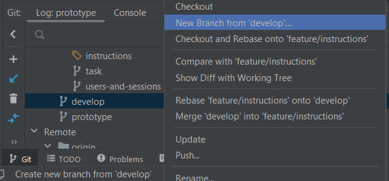
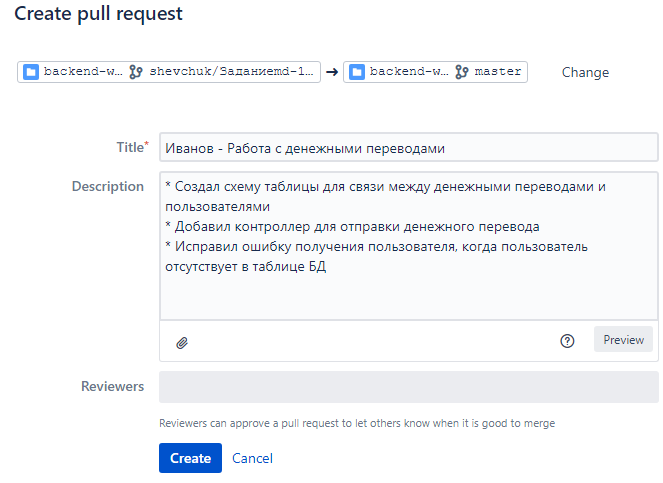

# Регламент

* [Выбор варианта проекта](#приступая-к-разработке)
* [Приступая к разработке](#приступая-к-разработке)
* [Создание Pull Request (PR)](#создание-pull-request-pr)
* [Процесс Code Review (CR)](#процесс-code-review-cr)

## Выбор варианта проекта

- Облегченный вариант.
  Выполнение задания начинается с частично реализованным функционалом.
  Ветка - prototype
- Усложнённый вариант.
  Имеется только базовая структура проекта.
  Ветка - develop

## Приступая к разработке

Вам необходимо иметь:
* Базовую ветку: фамилия/develop (или фамилия/prototype). Ветка в которую вы будете сливать ваши PR
* Фича ветка(-и) фамилия/feature. Ветка(-и) в которых в работаете и из которых будете создавать PR

Создать можно следующим образом:

1. Склонируйте себе проект
2. Ветка, указанная в вашем [выбранном варианте](#выбор-варианта-проекта),
   является вашей начальной веткой
3. От начальной ветки необходимо создать свою базовую ветку (на примере от develop):

    - Через Intellij IDEA 
    - Выполнив команду git checkout BRANCH_NAME develop
        Имя своей ветке задаёте как ivanov/develop или ivanov/prototype, подставляя свою фамилию.
4. В вашей созданной базовой ветке изменения **НЕ вносятся**. Эта ветка создана только для Pull Request (далее PR)
5. От ветки ivanov/develop аналогично п.2 отрезаете ветку ivanov/feature. В этой ветке вы работаете с кодом
   У вас получится следующая структура локальных веток 

## Создание Pull Request (PR)

По готовности вашего кода к ревью:

1. Запуште вашу develop и feature ветку в репозиторий
2. Переходите в удалённый репозиторий в раздел Pull requests. Создаете свой PR, нажав "Create pull request" справа
   сверху
3. В качестве Source-ветки выступает ваша фича-ветка (ex. ivanov/feature), в качестве Target-ветки выбирате вашу базовую
   ветку (ex. ivanov/develop).

   На этом этапе также убедитесь в PR попало именно те коммиты/изменения, которые вы хотите отдать на ревью 

   Называйте коммиты осмысленно (ex. "Исправил NPE при пустом кошельке", "Исправил баг в контроллере ...someComtrollerName").   
   Чем более осмысленный коммит и его описание - тем легче и быстрее пройдёт СR

4. Жмёте "Continue"
5. Заполняете поля:
    - Tittle: Фамилия - краткое описание изменений
    - Description - Подробное описание изменений. Также можете прикладвать скриншоты/диаграммы и прочее к PR
      
6. Жмёте "Create"  

P.S. К ревью отдаётся только работающий функционал (приложение запускается)

## Процесс Code Review (CR)

После [создания PR](#создание-pull-request-pr), дополнительно уведомите кураторов в канале Discord о готовности к CR.  
Далее всё общение по поводу PR происходит в самом PR.  

Кураторы могут оставить вам замечания/вопросы по вашему коду.
В случае небходимости исправления - правите в той же ветке у себя, 
коммитите новые изменения **новым коммитом** и пушите в репозиторий (не используйте force-push). 
Они автоматически подтянутся в PR    
Как только все замечания будут исправлены (куратор поставит вам Approve), можете сливать ваши изменения, нажав 
"Merge", также проставьте флаг "Delete source branch after merge".  

Не забудьте обновить вашу базовую ветку (git pull).   
Фича-ветку для дальнейшей работы можно создать новую      
